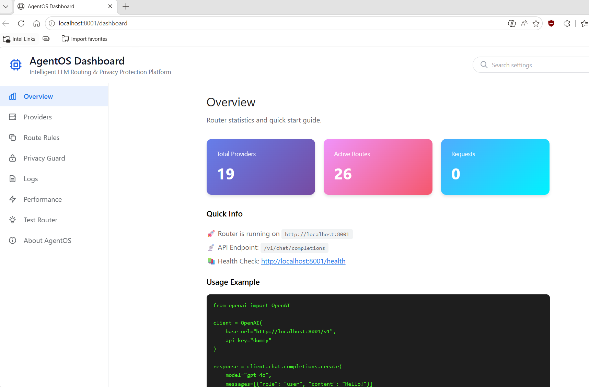

# AgentOS - LLM Routing Gateway

A production-ready LLM API routing gateway with a web-based configuration dashboard. Route requests across **15+ LLM providers** (OpenAI, Anthropic, AWS Bedrock, Azure, Google Gemini, DeepSeek, Qwen, Baichuan, Zhipu, Moonshot, MiniMax, vLLM, Ollama, LM Studio) with intelligent keyword-based routing, cost optimization, and hot configuration reload.



## 🌟 Key Features

- ✅ **Multi-Provider Routing** - 15+ providers: OpenAI, Anthropic, Bedrock, Azure, Gemini, DeepSeek, Qwen, MiniMax, vLLM, Ollama, and more
- ✅ **Web Dashboard** - Visual configuration editor with drag-drop routing rules
- ✅ **Smart Routing** - Keyword-based and wildcard pattern matching
- ✅ **Cost Optimization** - Auto-downgrade expensive models for simple tasks
- ✅ **Hot Reload** - Update configuration without restarting
- ✅ **OpenAI Compatible** - Drop-in replacement for OpenAI API
- ✅ **Streaming Support** - Full SSE (Server-Sent Events) passthrough
- ✅ **Production Ready** - Comprehensive test suite, error handling, backups
- 🆕 **Privacy Guard** - Three-layer security with PII masking, audit logging, and policy enforcement
- 🚀 **Transparent Proxy** - Automatic request interception without app configuration

## 🚀 Quick Start

### Mode 1: Transparent Proxy (Recommended - Zero Configuration!)

**Automatic interception - no app configuration needed!**

#### Option A: One-Click Start (Easiest)

```bash
# Windows
start_all.bat

# Opens two terminals:
# - Terminal 1: Router Server (port 8001)
# - Terminal 2: Proxy Server (port 8801)
```

This script automatically:
- ✅ Starts Router on port 8001
- ✅ Starts Proxy on port 8801
- ✅ Dashboard available at http://localhost:8001/dashboard
- ✅ Shows proxy configuration instructions

#### Option B: Manual Start

```bash
# 1. Install dependencies
pip install -r requirements.txt

# 2. Configure environment
cp config/.env.example config/.env
# Edit config/.env with your API keys

# 3. Start Router (Terminal 1)
python start_router.py

# 4. Start Proxy (Terminal 2)
python start_proxy.py

# 5. Configure Claude Code Extension (or other apps)
# Edit VS Code settings.json:
{
  "claudeCode.environmentVariables": [
    {
      "name": "HTTP_PROXY",
      "value": "http://localhost:8801"
    },
    {
      "name": "HTTPS_PROXY",
      "value": "http://localhost:8801"
    }
  ]
}

# Or set system-wide (Windows PowerShell):
$env:HTTP_PROXY="http://localhost:8801"
$env:HTTPS_PROXY="http://localhost:8801"

# Linux/Mac:
export HTTP_PROXY=http://localhost:8801
export HTTPS_PROXY=http://localhost:8801
```

#### Option C: Install mitmproxy Certificate (Required for HTTPS)

For HTTPS interception to work, install mitmproxy's CA certificate:

```bash
# 1. Start proxy once to generate certificate
python start_proxy.py
# Certificate created at: ~/.mitmproxy/mitmproxy-ca-cert.pem

# 2. Install certificate (Windows)
# Right-click mitmproxy-ca-cert.pem → Install Certificate
# → Place in "Trusted Root Certification Authorities"

# Or use PowerShell (admin):
Import-Certificate -FilePath ~/.mitmproxy/mitmproxy-ca-cert.pem `
  -CertStoreLocation Cert:\LocalMachine\Root

# 3. Restart VS Code / IDE
# Apps need to reload to pick up new certificates

# 4. Verify installation
certmgr.msc  # Should see "mitmproxy" in Trusted Root
```

**That's it!** Now all LLM requests from any app will be automatically intercepted and routed through Router!

```python
# Your app code stays the same - no base_url needed!
from openai import OpenAI

# Set proxy (once per session)
import os
os.environ['HTTP_PROXY'] = 'http://localhost:8801'
os.environ['HTTPS_PROXY'] = 'http://localhost:8801'

client = OpenAI(api_key="sk-xxx")  # Goes to api.openai.com
# But proxy intercepts it → Router → applies routing rules!

response = client.chat.completions.create(
    model="gpt-4o",
    messages=[{"role": "user", "content": "Hello!"}]
)
# Automatically routed based on config.yaml rules!
```

### Mode 2: Direct Router Mode (No Proxy)

**Requires setting base_url in your app:**

```bash
# 1. Install dependencies
pip install -r requirements.txt

# 2. Configure environment
cp config/.env.example config/.env
# Edit config/.env with your API keys

# 3. Start Router only
python start_router.py
```

Router starts on `http://localhost:8001`

```python
# App must configure base_url explicitly
from openai import OpenAI

client = OpenAI(
    api_key="dummy",  # Not used, router handles auth
    base_url="http://localhost:8001/v1/chat/completions"
)

response = client.chat.completions.create(
    model="gpt-4o",
    messages=[{"role": "user", "content": "Hello!"}]
)
```

### Dashboard Access

Open browser: **http://localhost:8001/dashboard**

Configure providers, routing rules, view logs - all through the web UI!

## 🎨 Web Dashboard

Modern web interface built with Vue 3 + Tailwind CSS (zero build process):

**Features:**
- ✅ **Live Edit & Save**: Click "Edit" on any provider or route to modify configuration directly
- ✅ **Visual Provider Management**: Add/edit/delete providers with form validation
- ✅ **Route Editor**: Edit match patterns, target providers, models, and keywords
- ✅ **Real-time Persistence**: Changes save immediately to `config.yaml` with auto-backup
- ✅ **Hot Reload**: Configuration updates without restart
- ✅ **Input Validation**: Invalid configs rejected with clear error messages

**Access:** http://localhost:8001/dashboard

### Editing Configuration via UI

**Edit Provider:**
1. Navigate to Providers page
2. Click "Edit" button on any provider card
3. Modify Base URL or API Key (`env:VAR_NAME` format supported)
4. Click "Save Changes" - backup created automatically at `config.yaml.backup`

**Edit Route:**
1. Navigate to Route Rules page
2. Click "Edit" button on any route card
3. Modify:
   - **Match Model**: Use `*` wildcards (e.g., `gpt-4*`)
   - **Target Provider**: Select from dropdown
   - **Target Model**: Use `preserve` or specific model name
   - **Keywords**: Comma-separated list (e.g., `translate, summary`)
4. Click "Save Changes" - hot reload applies instantly

All changes are validated server-side and reject invalid configurations with 400 status.

## ⚙️ Configuration

### config.yaml Structure

Located in `config/config.yaml`:

```yaml
# Define providers
providers:
  openai:
    base_url: "https://api.openai.com/v1"
    api_key: "env:OPENAI_API_KEY"  # Reads from environment

  deepseek:
    base_url: "https://api.deepseek.com/v1"
    api_key: "env:DEEPSEEK_API_KEY"

  local_vllm:
    base_url: "http://127.0.0.1:8000/v1"
    api_key: "EMPTY"

# Define routing rules (first match wins!)
routes:
  # Rule 1: Keyword-based routing
  - match_model: "gpt-4o"
    contains_keywords: ["translate", "summary"]
    target_provider: "local_vllm"
    target_model: "Qwen2-7B-Instruct"

  # Rule 2: Wildcard matching
  - match_model: "gpt-4*"
    target_provider: "deepseek"
    target_model: "deepseek-chat"

  # Rule 3: Fallback
  - match_model: "*"
    target_provider: "openai"
    target_model: "preserve"  # Keep original model name
```

**Edit via Dashboard:** http://localhost:8001/dashboard

## 🌐 Provider Support

AgentOS supports **15+ LLM providers** with intelligent routing and API format adaptation.

### Provider Support Matrix

| Category | Provider | Status | API Format | Auth Method | Notes |
|----------|----------|--------|------------|-------------|-------|
| **International** | **OpenAI** | ✅ Full | OpenAI | Bearer Token | Native support |
| | **Anthropic** | ✅ Full | Custom | x-api-key header | Full request/response conversion |
| | **AWS Bedrock** | ✅ Full | OpenAI | Bearer Token | Special model naming |
| | **Azure OpenAI** | ✅ Full | OpenAI | api-key header | API version parameter |
| | **Google Gemini** | ✅ Full | OpenAI | Bearer Token | OpenAI-compatible |
| | **Google Vertex AI** | ✅ Full | OpenAI | Bearer Token | OpenAI-compatible |
| **Chinese LLMs** | **MiniMax** | ✅ Full | OpenAI | Bearer Token | OpenAI-compatible |
| | **DeepSeek** | ✅ Full | OpenAI | Bearer Token | OpenAI-compatible |
| | **Qwen (Alibaba)** | ✅ Full | OpenAI | Bearer Token | OpenAI-compatible |
| | **Baichuan** | ✅ Full | OpenAI | Bearer Token | OpenAI-compatible |
| | **Zhipu (GLM)** | ✅ Full | OpenAI | Bearer Token | OpenAI-compatible |
| | **Moonshot** | ✅ Full | OpenAI | Bearer Token | OpenAI-compatible |
| **Local Inference** | **vLLM** | ✅ Full | OpenAI | None | GPU-accelerated |
| | **Ollama** | ✅ Full | OpenAI | None | Local deployment |
| | **LM Studio** | ✅ Full | OpenAI | None | Desktop app |

**Summary:** 15 providers with full support, featuring:
- ✅ Request/response format conversion (Anthropic)
- ✅ Auto-detection based on URL patterns
- ✅ Streaming SSE support for all providers
- ✅ Special handling for Azure API versions
- ✅ Complete Chinese LLM ecosystem
- ✅ Local inference support (vLLM, Ollama, LM Studio)

### Support Levels

**✅ Full Support (15 providers)**
- Request interception & model replacement
- Keyword-based routing
- Streaming (SSE) passthrough
- Transparent error handling

**⚠️ Partial Support (3 providers)**
- Anthropic Claude: Auto-adapter for `/messages` endpoint
- Google Gemini: Auto-adapter for custom format
- Baidu ERNIE: Requires OAuth 2.0 (basic support)

### Adding New Providers

**For OpenAI-Compatible Providers:**
```yaml
providers:
  new_provider:
    base_url: "https://api.example.com/v1"
    api_key: "env:NEW_PROVIDER_API_KEY"
```

Then add to `.env`:
```bash
NEW_PROVIDER_API_KEY=your-key-here
```

**For Custom API Formats:**
Implement adapter function in `gateway.py` - see Anthropic/Gemini adapters as examples.

## 🎯 Usage Examples

### Transparent Proxy Mode (Recommended)

**No app changes needed - automatic interception!**

```python
from openai import OpenAI

# Just set proxy environment variables (once per session)
import os
os.environ['HTTP_PROXY'] = 'http://localhost:8801'
os.environ['HTTPS_PROXY'] = 'http://localhost:8801'

# Use OpenAI normally - no base_url configuration!
client = OpenAI(api_key="sk-xxx")

response = client.chat.completions.create(
    model="gpt-4o",  # Will be routed according to gateway rules
    messages=[{"role": "user", "content": "Hello!"}]
)
# Gateway automatically intercepts and applies routing!
```

**Works with any LLM SDK:**

```python
# Anthropic
from anthropic import Anthropic
client = Anthropic(api_key="sk-ant-xxx")  # Auto-intercepted!

# DeepSeek
from openai import OpenAI
client = OpenAI(
    api_key="sk-xxx",
    base_url="https://api.deepseek.com/v1"
)  # Auto-intercepted!

# All requests automatically routed through gateway!
```

### Explicit Proxy Mode

**Manual configuration in app code:**

```python
from openai import OpenAI

client = OpenAI(
    api_key="dummy",  # Not used, gateway handles routing
    base_url="http://localhost:8001/v1"
)

response = client.chat.completions.create(
    model="gpt-4o",
    messages=[{"role": "user", "content": "Hello!"}]
)
```

### cURL

```bash
# Transparent mode (with proxy)
export HTTP_PROXY=http://localhost:8801
curl -X POST https://api.openai.com/v1/chat/completions \
  -H "Content-Type: application/json" \
  -H "Authorization: Bearer sk-xxx" \
  -d '{
    "model": "gpt-4o",
    "messages": [{"role": "user", "content": "Hello!"}]
  }'

# Explicit mode (direct to gateway)
curl -X POST http://localhost:8001/v1/chat/completions \
  -H "Content-Type: application/json" \
  -H "Authorization: Bearer dummy" \
  -d '{
    "model": "gpt-4o",
    "messages": [{"role": "user", "content": "Hello!"}]
  }'
```

### LangChain

```python
from langchain.chat_models import ChatOpenAI
import os

# Transparent mode
os.environ['HTTP_PROXY'] = 'http://localhost:8801'
llm = ChatOpenAI(
    openai_api_key="sk-xxx",
    model_name="gpt-4o"
)  # Will be intercepted by proxy

# Explicit mode
llm = ChatOpenAI(
    openai_api_key="dummy",
    openai_api_base="http://localhost:8001/v1",
    model_name="gpt-4o"
)
```

## 🧪 Testing

Run comprehensive test suite:

```bash
# Transparent proxy tests
python tests/test_transparent_proxy.py

# Gateway routing tests
python -m pytest tests/test_gateway.py -v

# UI edit/save functionality tests
python tests/test_edit_save.py

# Privacy Guard tests
python -m pytest tests/test_privacy_guard.py -v

# UI integration tests
python tests/test_ui_integration.py
```

**Test Coverage:**
- ✅ Transparent proxy interception
- ✅ LLM domain detection
- ✅ Non-LLM traffic passthrough
- ✅ Keyword-based routing
- ✅ Wildcard pattern matching  
- ✅ Model downgrading
- ✅ Default passthrough
- ✅ Error handling
- ✅ Provider edit and save
- ✅ Route edit and save (with keywords)
- ✅ Config validation and rejection
- ✅ Backup file creation
- ⏭️ Streaming (production-validated)

**All tests use mocked HTTP requests - zero API token consumption!**

## 🔧 API Endpoints

### LLM Proxy (OpenAI Compatible)

```
POST /v1/chat/completions
```

### Dashboard & Configuration

```
GET  /dashboard              # Web dashboard UI
GET  /api/config             # Get configuration as JSON
POST /api/config             # Update configuration (used by Edit/Save)
POST /api/reload             # Hot reload configuration
GET  /api/logs               # Get audit logs (with level filtering)
GET  /health                 # Health check
```

**Edit/Save via API:**
```bash
# Get current config
curl http://localhost:8001/api/config

# Save modified config (creates backup automatically)
curl -X POST http://localhost:8001/api/config \
  -H "Content-Type: application/json" \
  -d @config.json
```

## 📊 Routing Logic

**Rules are evaluated in order - first match wins!**

Example routing decisions:

| Request Model | Keywords | Matched Rule | Target | Result |
|---------------|----------|--------------|--------|--------|
| `gpt-4o` | "summary" | Rule 1 | local_vllm | Qwen2-7B-Instruct |
| `gpt-4o` | none | Rule 2 | openai | gpt-4o-mini |
| `gpt-4-turbo` | none | Rule 3 | deepseek | deepseek-chat |
| `claude-3` | none | Rule 4 | ollama | llama3 |

## 🎯 Common Use Cases

### Cost Optimization

Route expensive models to cheaper alternatives:

```yaml
- match_model: "gpt-4*"
  target_provider: "deepseek"
  target_model: "deepseek-chat"  # 10x cheaper
```

### Smart Downgrading

Route simple tasks to smaller models:

```yaml
- match_model: "gpt-4o"
  contains_keywords: ["translate", "summary"]
  target_provider: "openai"
  target_model: "gpt-4o-mini"
```

### Local Development

Route everything to local Ollama:

```yaml
- match_model: "*"
  target_provider: "ollama"
  target_model: "llama3"
```

### Vendor Lock-in Prevention

Easily switch providers without code changes - just update config!

## 📁 Project Structure

```
agentos/
├── gateway.py              # Main gateway application (port 8000)
├── proxy_server.py         # Transparent proxy server (port 8888)
├── privacy_guard.py        # Privacy Guard security module
├── data_masking.py         # PII masking module
├── session_manager.py      # Session state management
├── audit_logger.py         # Audit logging module
├── main.py                 # Legacy gateway (deprecated)
├── requirements.txt        # Python dependencies
├── README.md               # This file
├── PRIVACY_GUARD.md        # Privacy Guard documentation
├── config/
│   ├── config.yaml         # Provider & routing + privacy configuration
│   ├── .env.example        # Environment variable template
│   └── .env.gateway.example
├── web/
│   └── index.html          # Dashboard UI (Vue 3 + Tailwind)
├── tests/                  # All test files (organized)
│   ├── test_transparent_proxy.py  # Transparent proxy tests
│   ├── test_gateway.py     # Gateway test suite
│   ├── test_edit_save.py   # UI edit/save tests
│   ├── test_privacy_guard.py  # Privacy Guard unit tests (15 tests)
│   ├── test_privacy_guard_live.py  # Live integration tests
│   ├── test_ui_integration.py  # UI integration tests
│   ├── test_gateway.sh     # Gateway shell test script
│   └── demo_privacy_guard.sh  # Privacy Guard demo script
└── docs/
    └── CLAUDE.md           # Project development guidelines
```

## 🔒 Security

### Privacy Guard (NEW!)

Three-layer security system for LLM requests:

1. **Policy Check**: Conditional routing based on prompt characteristics
   - Block prompt injection attempts
   - Route long/sensitive prompts to secure providers
   - Enforce content policies

2. **Regex Audit**: Pattern-based detection
   - Block API keys, credentials, tokens
   - Log internal codenames and sensitive terms
   - Detect PII before it reaches LLMs

3. **Data Masking**: Bidirectional PII redaction
   - Mask emails, phones, SSNs in requests
   - Automatically unmask in responses (streaming supported!)
   - Transparent to end users

**Quick Example**:
```yaml
privacy_guard:
  enabled: true
  data_masking:
    rules:
      - name: "Email"
        pattern: "\\b[A-Za-z0-9._%+-]+@[A-Za-z0-9.-]+\\.[A-Z|a-z]{2,}\\b"
        placeholder_prefix: "[REDACTED_EMAIL_"
```

📖 **Full Documentation**: See [PRIVACY_GUARD.md](./PRIVACY_GUARD.md)

### Best Practices

- Use `env:VAR_NAME` for API keys (never hardcode)
- Keep `.env` out of version control
- Automatic config backups before save
- Input validation on all API endpoints
- Enable Privacy Guard in production

### Production Recommendations

- Enable HTTPS
- Add authentication middleware
- Set up rate limiting
- Enable audit logging
- Configure Privacy Guard rules

## 🛠️ Development

### Editing Providers and Routes

**Via Web Dashboard (Recommended):**
1. Open http://localhost:8001/dashboard
2. Click "Edit" button on any provider or route card
3. Modify configuration in the popup modal
4. Click "Save Changes" - backup created at `config.yaml.backup`

**Via Config File:**
1. Edit `config/config.yaml` directly
2. POST to `/api/reload` or restart gateway

**Adding New Provider:**
```yaml
providers:
  new_provider:
    base_url: "https://api.example.com/v1"
    api_key: "env:NEW_PROVIDER_KEY"
```

**Adding New Route:**
```yaml
routes:
  - match_model: "claude-*"
    target_provider: "new_provider"
    target_model: "preserve"
```

Route order matters - first match wins!

### Running Tests

```bash
# All tests
python -m pytest tests/test_gateway.py -v

# Specific test
python -m pytest tests/test_gateway.py::test_case1_keyword_downgrade -v

# With coverage
python -m pytest tests/test_gateway.py --cov=gateway
```

## 🏗️ Architecture

### Transparent Proxy Mode (Recommended)

**Envoy-Style Architecture** (inspired by semantic-router)

```
┌─────────────────┐
│  Claude Code    │  (Normal LLM SDK - no special config)
│  Extension      │  api.anthropic.com/v1/messages
└────────┬────────┘
         │ HTTP_PROXY=localhost:8801
         ▼
┌──────────────────────────────────────────────┐
│  mitmproxy Transparent Proxy (:8801)         │
│  • start_proxy.py                     │
│  • Intercepts HTTPS traffic                  │
│  • Certificate-based SSL interception        │
└────────┬─────────────────────────────────────┘
         │ Python function call
         ▼
┌──────────────────────────────────────────────┐
│  RouterProxyAddon (proxy_addon.py)           │
│  • Route matching (like ExtProc Filter)      │
│  • DNS bypass (dns_resolver.py)              │
│  • Request logging                           │
│  • Forward to Router                         │
└────────┬─────────────────────────────────────┘
         │ Forward to localhost:8001
         ▼
┌──────────────────────────────────────────────┐
│  Router Server (router_server.py:8001)       │
│  • Load config.yaml                          │
│  • Match routing rules (keywords, patterns)  │
│  • EnhancedLLMClient (15+ providers)         │
│  • Format conversion (Anthropic, Azure, etc.)│
│  • Web Dashboard (Vue 3 + Tailwind)          │
└────────┬─────────────────────────────────────┘
         │
         ├─────► OpenAI API
         ├─────► Anthropic API (format conversion)
         ├─────► AWS Bedrock (special auth)
         ├─────► Azure OpenAI (API version)
         ├─────► Google Gemini / Vertex AI
         ├─────► DeepSeek, Qwen, Baichuan, etc.
         └─────► vLLM, Ollama, LM Studio (local)
```

**Key Components**:

1. **mitmproxy** - HTTPS interception proxy (like Envoy)
2. **RouterProxyAddon** - Request processing logic (like ExtProc Filter)
3. **Router Server** - FastAPI server with enhanced multi-provider support
4. **EnhancedLLMClient** - Unified client supporting 15+ providers

**Architecture Highlights**:
- ✅ Zero configuration for client apps (just set HTTP_PROXY)
- ✅ SSL certificate trust for HTTPS interception
- ✅ DNS bypass to avoid routing loops
- ✅ Automatic provider detection and format conversion
- ✅ Compatible with Claude Code Extension, OpenAI SDK, Anthropic SDK, etc.

### Implementation Details

**Transparent Proxy Implementation** (inspired by [semantic-router](https://github.com/aurelio-labs/semantic-router)):

Our implementation uses **mitmproxy** (Python) instead of Envoy (C++) + ExtProc (Go), providing equivalent functionality:

| Component | semantic-router | AgentOS Router |
|-----------|----------------|----------------|
| **Proxy Layer** | Envoy Proxy | mitmproxy |
| **Processing Logic** | ExtProc Filter (Go) | RouterProxyAddon (Python) |
| **Request Interception** | gRPC ProcessRequest | `request()` method |
| **Response Processing** | gRPC ProcessResponse | `response()` method |
| **Configuration** | Envoy YAML | mitmproxy addon |

**Key Features**:

1. **DNS Bypass** (`dns_resolver.py`)
   - Resolves real IPs using Google DNS (8.8.8.8)
   - Prevents routing loops when hosts file is modified
   - Caches: `api.anthropic.com` → `160.79.104.10`

2. **SSL Certificate Installation**
   - mitmproxy generates CA certificate on first run
   - Install to system trust store for HTTPS interception
   - Location: `~/.mitmproxy/mitmproxy-ca-cert.pem`

3. **Request Processing Flow**
   - Intercept LLM API requests (Anthropic, OpenAI, etc.)
   - Forward to Router (localhost:8001) with headers
   - Router applies routing rules and provider selection
   - EnhancedLLMClient handles provider-specific format conversion

4. **Provider Auto-Detection**
   - Based on URL patterns (e.g., `anthropic.com` → `anthropic` type)
   - Automatic authentication header construction
   - Format conversion (Anthropic OpenAI ↔ Messages API)

**Startup**:
```bash
# Start Router
python start_router.py  # Port 8001

# Start Proxy (in another terminal)
python start_proxy.py  # Port 8801

# Or use one-click startup
start_all.bat
```

### Explicit Proxy Mode

```
┌─────────────────┐
│   Agent/App     │  (Configured with base_url)
│  OpenAI SDK     │  base_url="http://localhost:8001/v1"
└────────┬────────┘
         │
         ▼
┌──────────────────────────────────────────────┐
│      LLM Routing Gateway (gateway.py:8000)   │
│  • Load config.yaml                          │
│  • Match routing rules (keywords, patterns)  │
│  • Rewrite model name                        │
│  • Select provider + API key                 │
│  • Web Dashboard (Vue 3 + Tailwind)          │
└────────┬─────────────────────────────────────┘
         │
         ├─────► OpenAI API
         ├─────► DeepSeek API
         ├─────► Qwen (Alibaba)
         ├─────► Local Ollama
         └─────► Local vLLM
```

## 📚 Documentation

All documentation is consolidated in this README. See CLAUDE.md for project-specific development guidelines.

## 🐛 Troubleshooting

### Transparent Proxy Issues

**Proxy not intercepting requests:**
- Check proxy is running: `netstat -an | findstr 8888` (Windows) or `lsof -i :8888` (Mac/Linux)
- Verify environment variables are set: `echo %HTTP_PROXY%` (Windows) or `echo $HTTP_PROXY` (Mac/Linux)
- Check gateway is running: `curl http://localhost:8001/health`
- Review proxy logs for interception messages

**HTTPS interception not working:**
- mitmproxy requires SSL certificate installation for HTTPS interception
- Certificate location: `~/.mitmproxy/mitmproxy-ca-cert.pem` (auto-generated on first run)
- **Windows**: Right-click cert → Install → "Trusted Root Certification Authorities"
- **PowerShell (admin)**: `Import-Certificate -FilePath ~/.mitmproxy/mitmproxy-ca-cert.pem -CertStoreLocation Cert:\LocalMachine\Root`
- **After install**: Restart VS Code / IDE to pick up new certificates
- **Verify**: Open `certmgr.msc` → Trusted Root → look for "mitmproxy"

**Requests not in gateway logs:**
- Transparent proxy forwards to gateway - check both proxy and gateway logs
- LLM domain might not be in detection list - add to `LLM_DOMAINS` in `proxy_server.py`
- Some apps might ignore proxy settings - use explicit mode instead

### Gateway Issues

**Gateway won't start:**
- Check `config/config.yaml` syntax (valid YAML)
- Verify environment variables are set in `.env`
- Run `pip install -r requirements.txt`

**Requests fail:**
- Check provider API keys are correct
- Verify provider `base_url` is accessible
- Check gateway logs for errors

**Wrong routing:**
- Routes match in order (first match wins)
- More specific rules should be at the top
- Test with dashboard's visual editor

**Dashboard not loading:**
- Ensure `web/index.html` exists
- Check gateway is running: `curl http://localhost:8001/health`
- Try direct URL: http://localhost:8001/dashboard

## 🔧 Proxy Setup for Different Network Environments

### Scenario 1: Machine WITHOUT Existing Proxy (Direct Internet)

**Simplest case - just set our proxy:**

```bash
# Windows (CMD)
set HTTP_PROXY=http://localhost:8801
set HTTPS_PROXY=http://localhost:8801

# Linux/Mac
export HTTP_PROXY=http://localhost:8801
export HTTPS_PROXY=http://localhost:8801
```

### Scenario 2: Machine WITH Corporate Proxy

**Your machine already uses a corporate proxy (e.g., `http://proxy.company.com:8080`).**

#### Option A: Proxy Chain (Recommended)

Our proxy forwards to your corporate proxy automatically.

**Step 1: Configure upstream proxy**

Edit `proxy_server.py` line ~45:
```python
UPSTREAM_PROXY = "http://proxy.company.com:8080"
```

Or set environment variable:
```bash
set UPSTREAM_PROXY=http://proxy.company.com:8080
python proxy_server.py
```

**Step 2: Set your app to use our proxy**
```bash
set HTTP_PROXY=http://localhost:8801
set HTTPS_PROXY=http://localhost:8801
```

**Result:**
- ✅ LLM requests → Our proxy (8888) → Gateway (8000) → LLM APIs
- ✅ Other requests → Our proxy (8888) → Corporate proxy → Internet

#### Option B: App-Specific Proxy

Keep system proxy unchanged, set proxy only in LLM app code:

```python
import os
os.environ['HTTP_PROXY'] = 'http://localhost:8801'
os.environ['HTTPS_PROXY'] = 'http://localhost:8801'

from openai import OpenAI
client = OpenAI(api_key="sk-xxx")
# Only this app uses our proxy
```

#### Option C: Explicit Mode (No Transparent Proxy)

Skip proxy entirely, use direct gateway URL:

```python
from openai import OpenAI
client = OpenAI(
    api_key="dummy",
    base_url="http://localhost:8001/v1"
)
# No proxy confusion, simple and explicit
```

### Which Option Should I Choose?

| Scenario | Recommended Option | Why |
|----------|-------------------|-----|
| Direct internet access | Transparent Proxy | Simplest, zero config |
| Corporate proxy, testing multiple apps | Proxy Chain (Option A) | All apps work seamlessly |
| Corporate proxy, one LLM app | App-Specific (Option B) | Minimal system changes |
| Complex network, production | Explicit Mode (Option C) | Most reliable, no magic |

## ❓ FAQ

### When should I use Transparent Proxy vs Explicit Proxy?

**Use Transparent Proxy when:**
- ✅ You want zero code changes in your apps
- ✅ You're testing multiple LLM apps
- ✅ You want automatic interception for all apps on your machine
- ✅ You're experimenting with different providers

**Use Explicit Proxy when:**
- ✅ You only need routing for one specific app
- ✅ You want more control over which requests are routed
- ✅ You don't want to set system-wide proxy
- ✅ You're deploying to production (more explicit = less magic)

### Does Transparent Proxy work with HTTPS?

Yes! Most LLM SDKs (OpenAI, Anthropic, etc.) respect the `HTTP_PROXY` environment variable for HTTPS requests. The proxy uses HTTP CONNECT tunneling to intercept HTTPS traffic.

**Note:** Full MITM SSL interception (decrypting HTTPS) is not currently implemented. The current implementation relies on apps respecting proxy environment variables.

### What LLM providers are supported in Transparent Mode?

All providers supported in explicit mode work in transparent mode:
- OpenAI (api.openai.com)
- Anthropic (api.anthropic.com)
- DeepSeek (api.deepseek.com)
- Qwen/Alibaba (dashscope.aliyuncs.com)
- Zhipu GLM (open.bigmodel.cn)
- Moonshot, Baidu, MiniMax, Groq, Together AI, Mistral, Perplexity
- Local: Ollama, vLLM, LM Studio

### Can I add new LLM providers to intercept?

Yes! Edit `proxy_server.py` and add domains to `LLM_DOMAINS`:

```python
LLM_DOMAINS = {
    "api.openai.com",
    "api.anthropic.com",
    "your-new-llm.com",  # Add here!
}
```

Then add the provider configuration to `config/config.yaml`.

### How do I debug why my requests aren't being intercepted?

1. Check proxy logs - you should see messages like `🎯 LLM domain detected`
2. Verify HTTP_PROXY is set: `echo $HTTP_PROXY` (Mac/Linux) or `echo %HTTP_PROXY%` (Windows)
3. Check if domain is in `LLM_DOMAINS` list
4. Try explicit mode to verify gateway routing works
5. Some apps might not respect proxy settings - check app documentation

### My machine uses corporate proxy - how do I set up transparent proxy?

See [Proxy Setup for Different Network Environments](#-proxy-setup-for-different-network-environments) section above. 

**Quick answer:**
1. Edit `proxy_server.py`: Set `UPSTREAM_PROXY = "http://proxy.company.com:8080"`
2. Start services: `start_transparent_mode.bat`
3. Set proxy: `set HTTP_PROXY=http://localhost:8801`
4. Run your app - LLM requests intercepted, other traffic goes through corporate proxy!

### Non-LLM traffic (pip, git) fails when using transparent proxy

**Cause:** Our proxy doesn't know about your corporate proxy

**Solution:** Use Proxy Chain - set `UPSTREAM_PROXY` in `proxy_server.py`:
```python
UPSTREAM_PROXY = "http://proxy.company.com:8080"
```

Now all non-LLM traffic forwards to your corporate proxy automatically.

### Can I use this in production?

Yes, but consider:
- ✅ Use explicit mode for production (more explicit, less magic)
- ✅ Enable Privacy Guard for sensitive data
- ✅ Add authentication middleware
- ✅ Set up rate limiting
- ✅ Enable HTTPS for gateway
- ⚠️ Transparent proxy is great for development/testing

## 📝 Project Guidelines

**Language Policy:** All code, comments, and documentation in English (see `docs/CLAUDE.md`)

**Documentation Policy:** No excessive summary files - keep repo clean (see `docs/CLAUDE.md`)

## 📄 License

MIT

---

**Need help?** Open an issue on GitHub or check the logs for detailed error messages.

**Quick Links:**
- Dashboard: http://localhost:8001/dashboard
- Health Check: http://localhost:8001/health
- API Docs: http://localhost:8001/docs (FastAPI auto-generated)
- Proxy Server: http://localhost:8801 (transparent mode)
